# Reading Notes

Welcome to my Reading Notes website! This site is a collection of my notes from various coding courses. I've documented my learning journey through different stages of software development, including the technologies and tools I've used along the way.

---

## Code 102 - Intro to Software Development

In this course, I delved into the basics of software development, learning the fundamentals of HTML, CSS, and JavaScript. It was an exciting introduction to the world of coding and set the foundation for my coding journey.

---

## Code 201 - Foundations of Software Development

Building on my introductory knowledge, Code 201 taught me the core concepts of web development. I gained proficiency in HTML, CSS, JavaScript, and got hands-on experience with responsive design principles.

---

## Code 301 - Intermediate Software Development

Code 301 was a significant step in my coding journey. I delved deeper into web development, focusing on front-end and back-end technologies. I learned about server-side programming using Node.js and delved into the world of modern frameworks like React.

---

## Code 401 - Advanced Software Development

I'm currently diving into Code 401 - the pinnacle of software development education. As I embark on this journey, I'm immersing myself in the intricate world of advanced programming concepts, architecture design, and the intricacies of working with databases and APIs.

---

## Understanding Relational Databases and SQL

After completing the SQLBOT lessons on SQL Queries and Database Management (Lessons 1-6 and 13-18), I've gained a comprehensive understanding of relational databases and SQL.

**Relational Databases:** I now grasp the significance of structuring data into tables with well-defined relationships. Normalization and database design concepts have enabled me to create efficient, organized databases that store and manage information logically.

**SQL Queries:** From simple SELECT statements to complex JOIN operations, I've learned to extract data with precision. Crafting queries to filter, sort, and aggregate data has become second nature, empowering me to retrieve exactly what I need from databases.

**Database Management:** I've explored various aspects of managing databases, including creating tables, defining constraints, and performing backups. Learning about transaction management has given me a deeper appreciation for data integrity and consistency.

**Application of Knowledge:** Through hands-on tasks and assignments, I've applied SQL to practical scenarios. Whether it's retrieving specific data, updating records, or combining information from multiple tables, I'm confident in my ability to manipulate databases effectively.

**Screenshots:** Below are some screenshots showcasing my progress:

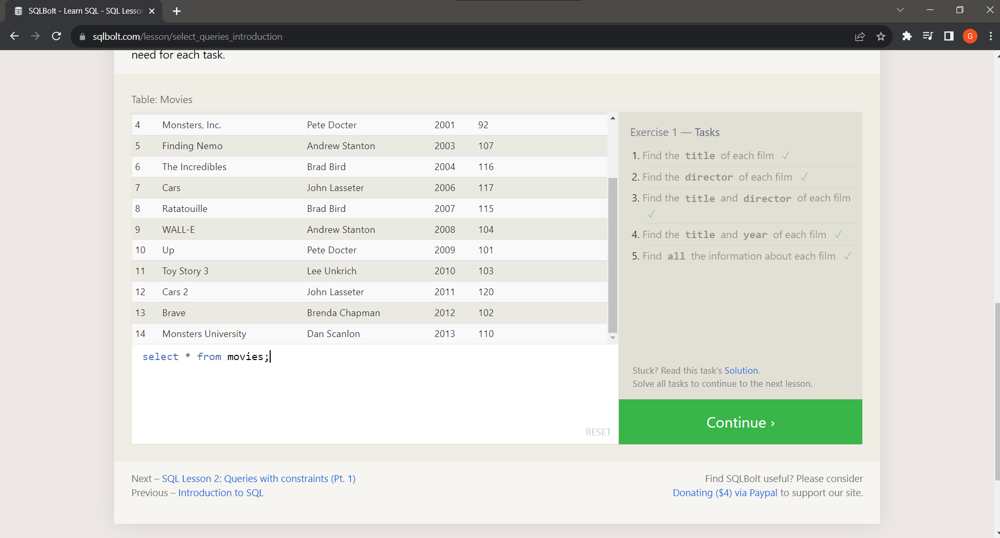

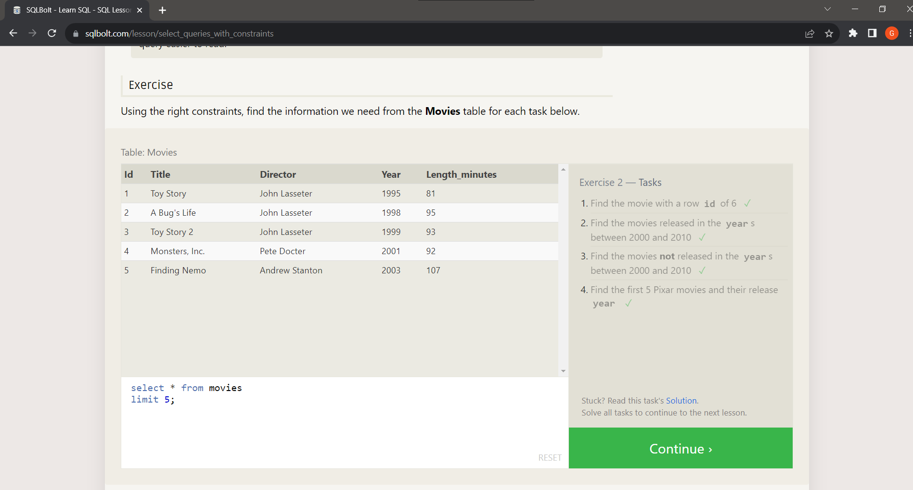

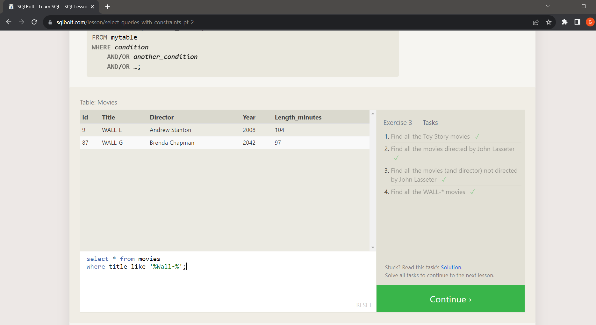

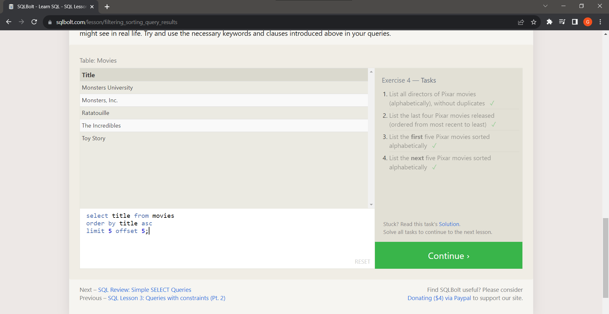

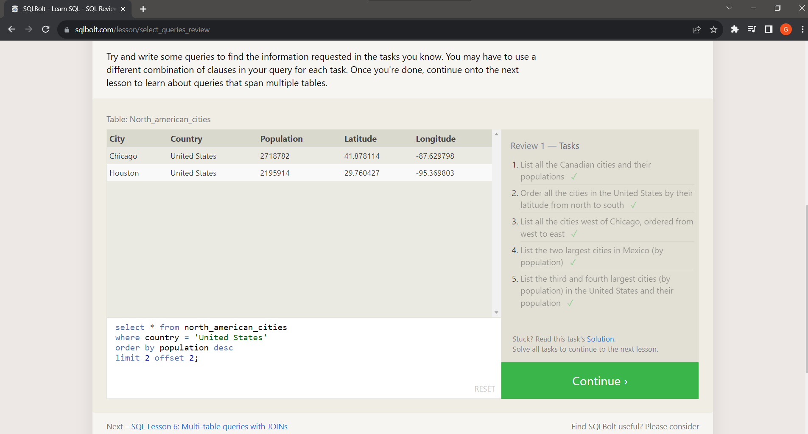

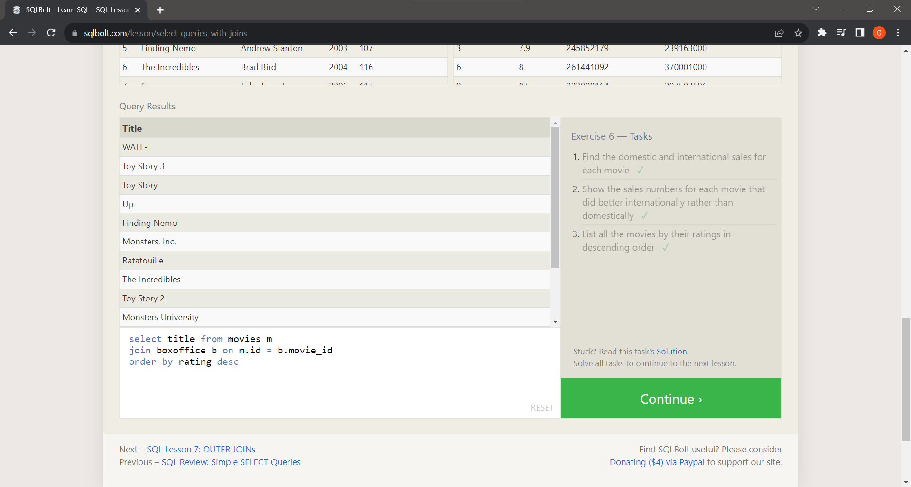

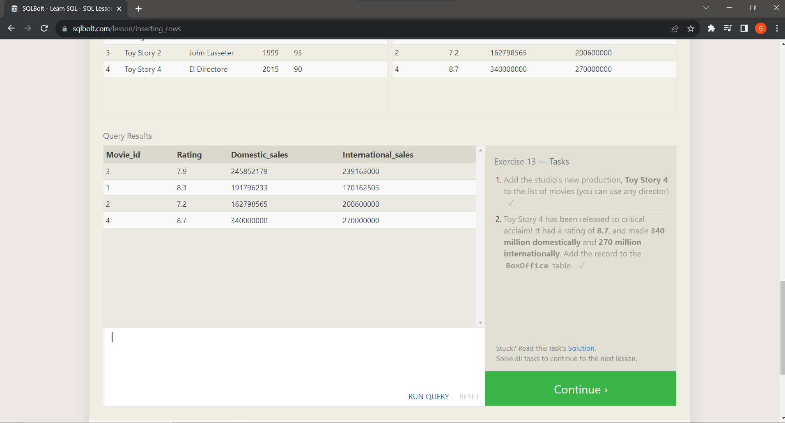

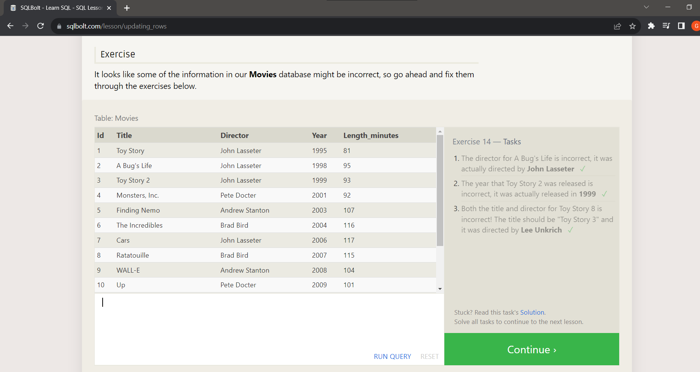

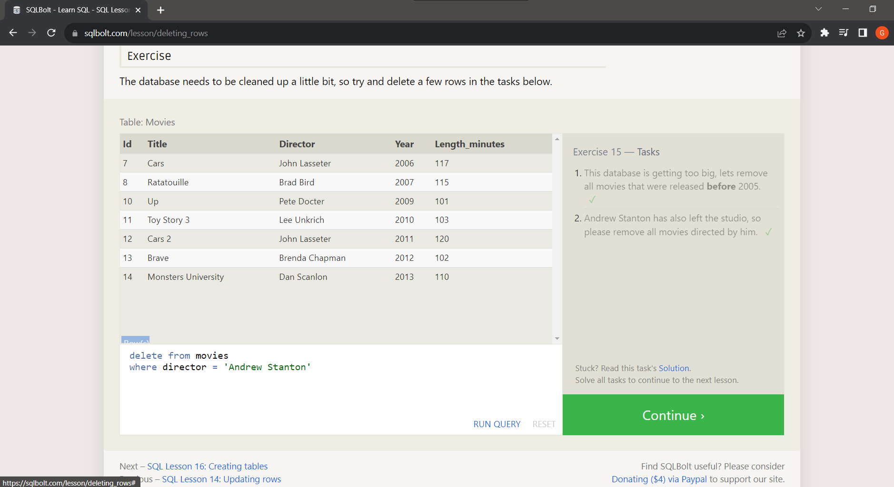

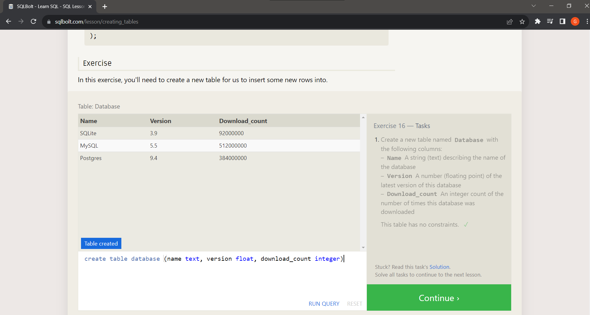

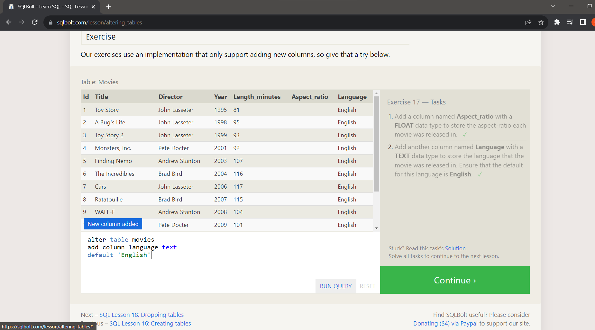

---

## Practice in the Terminal

**Command Line Mastery:** One of my most significant takeaways has been mastering the command line. From basic navigation using `cd` and `ls`, to advanced concepts like piping and redirection, I've become confident in efficiently interacting with the system.

**File Manipulation and Process Management:** Learning to manipulate files, create directories, and manage processes has given me greater control over my development environment. Whether it's creating files using `touch`, copying with `cp`, or managing running processes, I now feel more capable and efficient.

**Discovery of Wildcards:** Wildcards have been a revelation. The flexibility they provide in working with file names and paths has saved me significant time and effort. Whether using `*` for zero or more characters, `?` for a single character, or `[ ]` for ranges, I've harnessed their power for efficient file operations.

### My 'Ah Hah' Moments

**Piping and Redirection Magic:** Discovering the power of piping and redirection (`|`, `>`, `>>`, `<`) has been eye-opening. Redirecting output to files or chaining commands together has made data manipulation and analysis so much more efficient.

**Wildcards Unleashed:** Realizing the potential of wildcards (`*`, `?`, `[ ]`) has been a game-changer. These symbols act as versatile tools for working with files, and they've significantly reduced repetitive tasks.

## Interesting Code Snippet

One of the most interesting code snippets I've come across is using the `du -sh ./*` command to quickly find the size of directories in my current directory. This snippet allows me to assess disk usage at a glance:

