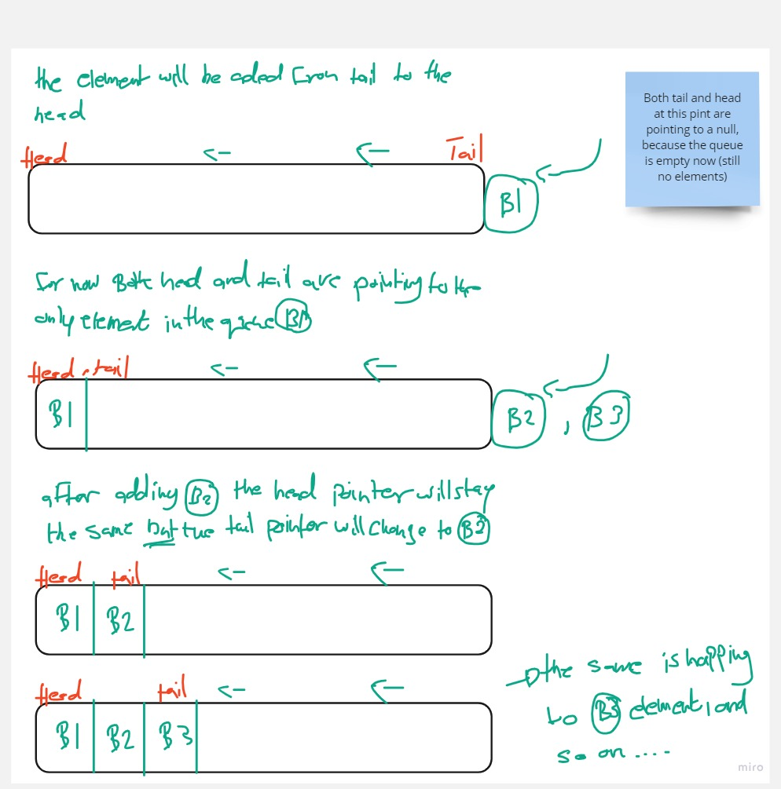
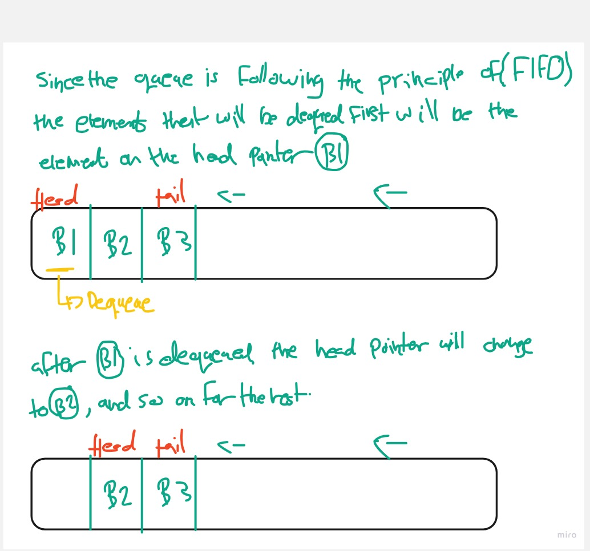

# Stack And Queue

## Why, What, How... Tutorial / walk through

### Stacks:

#### Why:

Stacks are fundamental data structures used to manage collections of elements in computer science. They are designed to follow specific rules for adding and removing elements, making them efficient for certain operations.

#### What:

A stack is a linear data structure that follows the Last In, First Out (LIFO) principle, which means the last element added to the stack will be the first one to be removed.

Common operations associated with stacks include push (adding an element to the top) and pop (removing an element from the top).

#### How:

##### Push Operation:

- The push operation adds an element to the top of the stack
- It's an O(1) operation, meaning the time it takes is constant regardless of the number of elements in the stack

##### Stpes:
 
1. Create a new node with the value you want to add
2.  Set the next property of the new node to point to the current top
3. Update the top reference to point to the new node

Visualized example for stack push operation:

##### Pop Operation:

- The pop operation removes the top element from the stack and returns its value.
- It's also an O(1) operation.

##### Stpes:

1. Create a temporary reference (temp) and point it to the current top
2. Update the top reference to point to the next node
3. Clear the next property of temp to release any references
4. Return the value of temp

Visualized example for stack pop operation:

---

### Queue 

#### Why:

Queues are essential data structures used for managing items in a linear order, where elements are processed in the order they are added. They follow specific rules for adding and removing elements, making them suitable for various applications.

#### What:

A queue is a linear data structure that follows the First In, First Out (FIFO) principle, which means the first element added to the queue will be the first one to be removed. Common operations associated with queues include enqueue (adding an element to the rear) and dequeue (removing an element from the front)

#### How:

##### Enqueue Operation:

- The enqueue operation adds an element to the rear of the queue
- It's an O(1) operation, meaning the time it takes is constant regardless of the number of elements in the queue

##### Stpes:
 
1. Create a new node with the value you want to add
2. Set the next property of the current tail node to point to the new node
3. Update the tail reference to point to the new node

Visualized example for queue enqueue operation:

##### Dequeue Operation:

- The dequeue operation removes the front element from the queue and returns its value.
- It's also an O(1) operation

##### Stpes:
 
1. Create a temporary reference (temp) and point it to the current front
2. Update the head reference to point to the next node
3. Clear the next property of temp to release any references.
4. Return the value of temp

Visualized example for queue dequeue operation:

