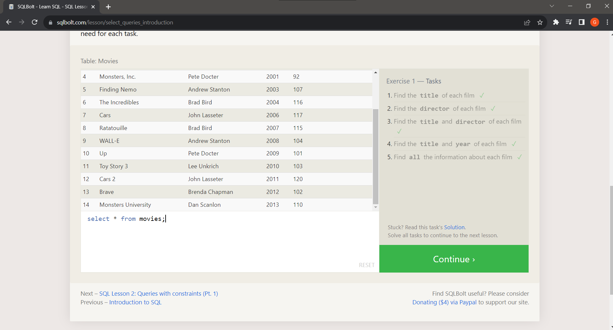
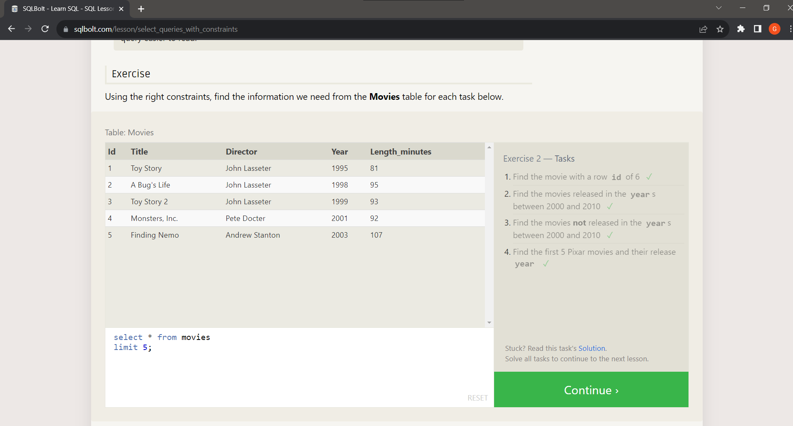
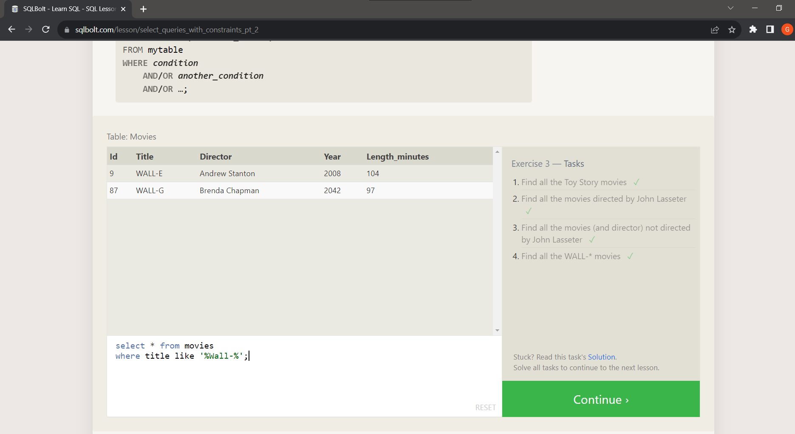
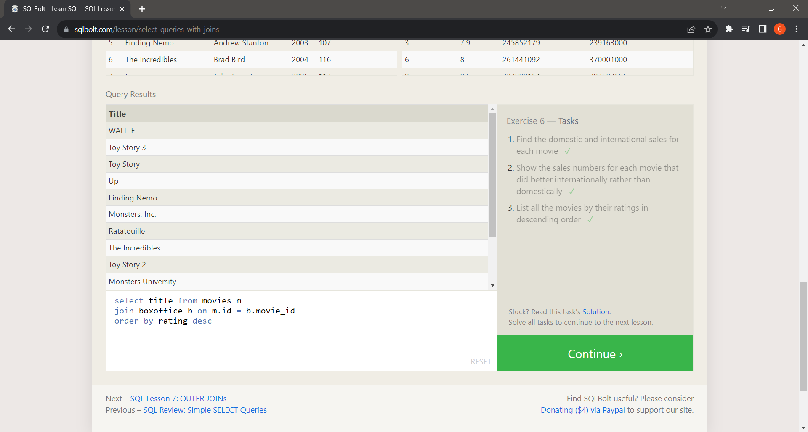
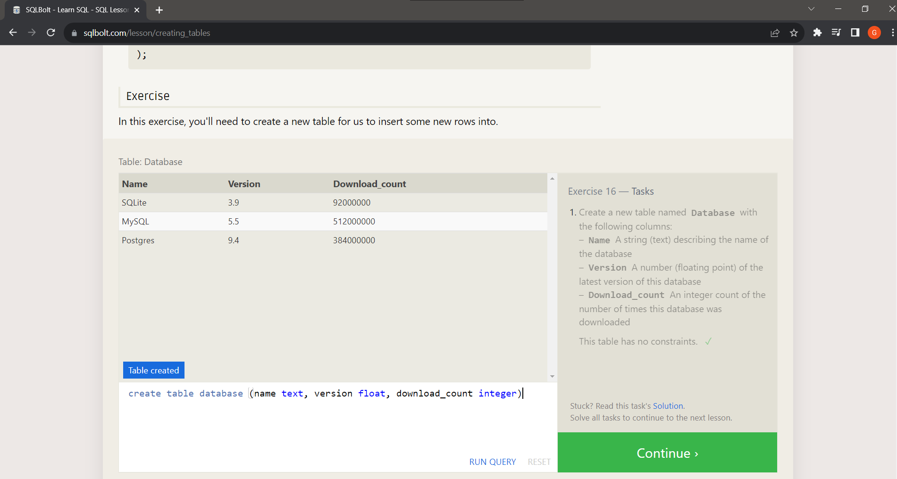
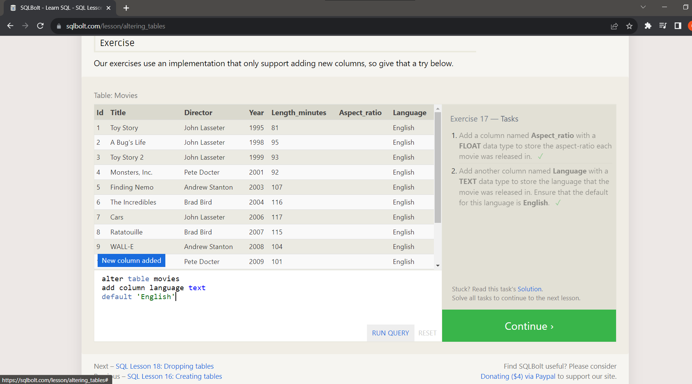
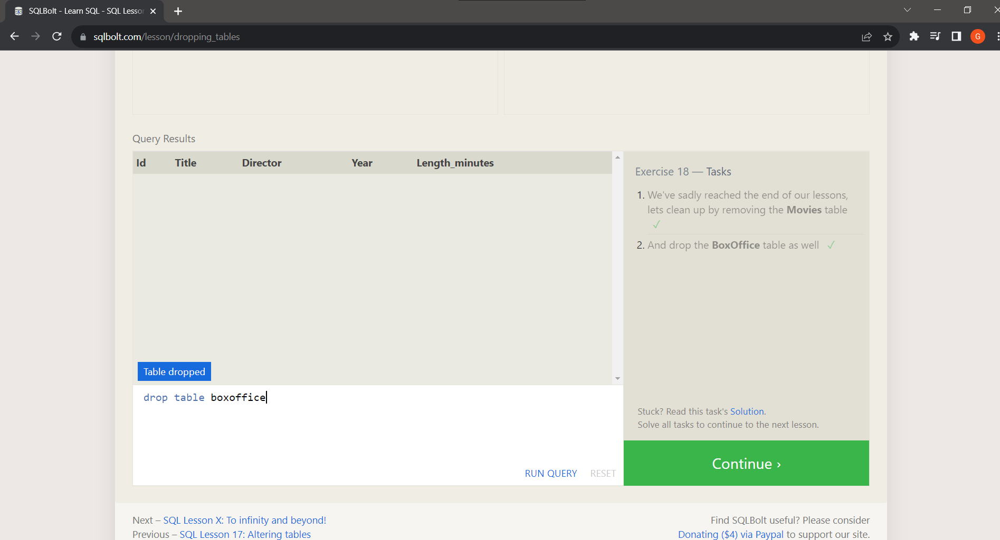

## Understanding Relational Databases and SQL

After completing the SQLBOT lessons on SQL Queries and Database Management (Lessons 1-6 and 13-18), I've gained a comprehensive understanding of relational databases and SQL.

**Relational Databases:** I now grasp the significance of structuring data into tables with well-defined relationships. Normalization and database design concepts have enabled me to create efficient, organized databases that store and manage information logically.

**SQL Queries:** From simple SELECT statements to complex JOIN operations, I've learned to extract data with precision. Crafting queries to filter, sort, and aggregate data has become second nature, empowering me to retrieve exactly what I need from databases.

**Database Management:** I've explored various aspects of managing databases, including creating tables, defining constraints, and performing backups. Learning about transaction management has given me a deeper appreciation for data integrity and consistency.

**Application of Knowledge:** Through hands-on tasks and assignments, I've applied SQL to practical scenarios. Whether it's retrieving specific data, updating records, or combining information from multiple tables, I'm confident in my ability to manipulate databases effectively.

**Screenshots:** Below are some screenshots showcasing my progress:

