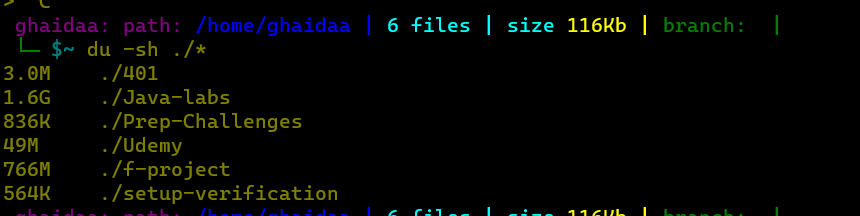

## Practice in the Terminal

**Command Line Mastery:** One of my most significant takeaways has been mastering the command line. From basic navigation using `cd` and `ls`, to advanced concepts like piping and redirection, I've become confident in efficiently interacting with the system.

**File Manipulation and Process Management:** Learning to manipulate files, create directories, and manage processes has given me greater control over my development environment. Whether it's creating files using `touch`, copying with `cp`, or managing running processes, I now feel more capable and efficient.

**Discovery of Wildcards:** Wildcards have been a revelation. The flexibility they provide in working with file names and paths has saved me significant time and effort. Whether using `*` for zero or more characters, `?` for a single character, or `[ ]` for ranges, I've harnessed their power for efficient file operations.

### My 'Ah Hah' Moments

**Piping and Redirection Magic:** Discovering the power of piping and redirection (`|`, `>`, `>>`, `<`) has been eye-opening. Redirecting output to files or chaining commands together has made data manipulation and analysis so much more efficient.

**Wildcards Unleashed:** Realizing the potential of wildcards (`*`, `?`, `[ ]`) has been a game-changer. These symbols act as versatile tools for working with files, and they've significantly reduced repetitive tasks.

## Interesting Code Snippet

One of the most interesting code snippets I've come across is using the `du -sh ./*` command to quickly find the size of directories in my current directory. This snippet allows me to assess disk usage at a glance:

